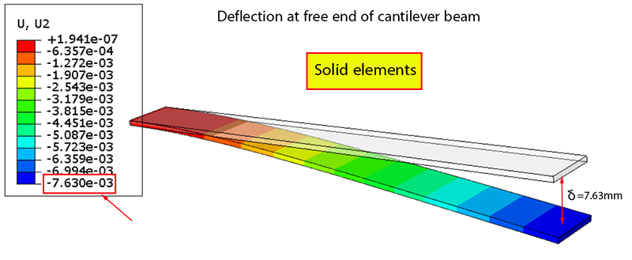

# Introduction to Finite Element Method of Partial Differential Equations and an Example of Its Application in Analyzing Energy Harversting from a Vibrating Piezoelectric Cantilever Beam

## Table of Contents

## Overview
The finite element method (FEM) is a numerical technique used to approximate the solution of a boundary value partidal differential equation (PDE) by solving an algebraic system of equations. FEM discretizes the domain of the partial differential equation into a mesh of smaller and simpler subdomains, called elements, connected by nodes[https://www.simscale.com/blog/what-is-finite-element-method/]. Considering boundary conditions at the nodes, a system of basis functions are calculated to model these elements. These functions are then assembled into a larger system of equations over the entire domain and solved using numerical methods

## Purpose of FEM
The purpose of FEM is to create a simulation, also known as a finite element analysis (FEA). This simulation is used to provide a structural analysis of how a particular product or design would react under physical phenomenons in the real world. FEA breaks down the entire model into smaller elements within a mesh, which engineers use to test how the different elements of a design interact and perform under physical effects (e.g. vibration, heat, fluid flow, electromagnetic forces, and others) [https://www.autodesk.com/solutions/simulation/finite-element-analysis]. Such simulations are done with software packages that implement FEM to solve the PDEs governing these physical effects. Some common FEA software packages include ANSYS [https://www.ansys.com/], SIMSCALE [https://www.simscale.com/], Abaqus FEA [https://www.3ds.com/products-services/simulia/], and COMSOL Multiphysics [https://www.comsol.com/]. Shown below is an example of FEA analysis of a cantilever beam under pressure loading solid, shell, and beam elements in Abaqus FEA software. 

## Background: Partial Differential Equations and Boundary Conditions
In discussing FEM it is important to first review the background of PDEs and their boundary conditions: A PDE is an equation of partial derivatives of an unknown function with respect to more than one independent variable [txtbook chapter 11]. The order of a PDE is determined by the highest-order partial derivative appearing in the PDE. For example, consider the Euler-Bernoulli Beam PDE, a fourth-order PDE, representing the transverse displacement, **$u(x,t)$**, of a beam over space and time (with assumptions mentioned in [https://www.sciencedirect.com/science/article/abs/pii/B9780128185636000171]). : 

$$
EI \dfrac{\partial^4 u}{\partial x^4}= 0
$$

where **$E$** is the Young's modulus of the beam material and **$I$** is the moment of inertia of the beam's cross-sectional area. Now, to limit the possible solutions of the PDE, and any PDE in general, boundary conditions (BCs) must be provided. In doing so, the PDE becomes a boundary-value problem. Consider the BCs for the above Euler-Bernoulli Beam PDE for a clamped (fixed) piezoelectric cantilever beam with a proof mass at the free end [file:///Users/danielcanales/Desktop/Conference_4_ICME2019_BUETBangladesh.pdf]. In such a case, the proof mass is approximated as a shear force applied at the free end.

The BCs are: 

$$
\left.u\right|_{x=0}=0
$$

$$
\left.\dfrac{\partial u}{\partial x}\right|_{x=0}=0
$$

$$
\left.\dfrac{\partial^2 u}{\partial x^2}\right|_{x=L}=0
$$

$$
\left.EI\dfrac{\partial^3 u}{\partial x^3}\right|_{x=L} = m\dfrac{\partial^2 u}{\partial t^2}
$$

where **$L$** is the length of the beam, **$m$** is the mass of the proof mass, and **$\dfrac{\partial^2 u}{\partial t^2}$** is the acceleration of the proof mass. Note, with FEM, there are not only BCs for the domain of the problem, but also boundary conditions at the nodes of the problem's mesh. 

## Steps of the Finite Element Method 
The FEM of a boundary-value problem includes the following steps [https://davis.wpi.edu/~matt/courses/fem/fem.htm]:
- Discretization of the problem's domain
- Selection of the interpolation functions, also known as shape functions, to provide an approximation of the unknown solution within an element
- Assembly of interpolation functions into a larger system of equations over the entire domain 
- Solution of the system of equations

When completing FEA, desired parameters of the solution can be displayed in form of curves, plots, or color pictures, which are more meaningful and interpretable. 

### Discretization of the problem's domain
The PDE must be represented as an integral equation so that the problem may later by represented as system of. The discretization process begins with transforming the PDE into its weak form [https://www.simscale.com/blog/what-is-finite-element-method/]. 

EM discretizes the domain of the partial differential equation into a mesh of smaller and simpler subdomains, called elements, connected by nodes[https://www.simscale.com/blog/what-is-finite-element-method/]. Considering boundary conditions at the nodes, a system of basis functions are calculated to model these elements. These functions are then assembled into a larger system of equations over the entire domain and solved with numerical methods. 

<!-- 
# Finite Element Method in Finite Element Analysis Workflow and its Application in Analyzing Energy Harvested from a Piezoelectric Cantilever Beam

## Table of Contents
- [Overview](#Overview)
- [Background](#Background)
- [Finite Element Method Overview in FEA Workflow](#Finite-Element-Method-Overview-in-FEA-Workflow)
- [Common Applications](#Common-Applications)
- [Formulation](#Formulation)
- [Penalty Function Options](#Penalty-Function-Options)
- [References](#References)

## Overview
The finite element method (FEM) is a numerical technique used to achieve finite element analysis [FEA] (https://www.comsol.com/multiphysics/finite-element-method?parent=physics-pdes-numerical-042-62). More specfiically, FEM computes approximate solutions to boundary and initial-value problems of partial differential equations (PDEs). These PDEs typically arise in engineering and mathematical modeling to model, simulate, and predict the behavior of a structure (or system) in a given physical phenomenon. Examples of such physical phenomenons include heat transfer, mass transport, fluid flow, electromagnetics, and more. Given the governing equations, initial and boundary conditions, material properties of the structure, and the behavior of the structure, FEM constructs a mesh of the structure and divides it into smaller and simpler subdomains, called finite elements, connected by nodes. The behavior of the finite elements are described with equations assembled into a larger system of equations to model the entire problem, which is then solved with numerical methods. In addition to a background and overview of the steps involved in using FEM with FEA software packages, this article provides an example of using FEM to analayze energy harvested from a vibrating piezoelectric cantilever beam.

## Background
In discussing FEM and its application towards FEA of a piezoelectric cantilever beam, it is important to first review the background of the following items:
- Partial differential equations
- Classifications of boundary conditions (BCs) for continuous systems 
- Principle of Energy Minimization
- Piezoelectric Effect 

### Partial Differential Equations (PDEs)
A PDE is an equation of partial derivatives of an unknown function with respect to more than one independent variable [txtbook chapter 11]. PDEs can be described by their order and classifications. The order of a PDE is determined by the highest-order partial derivative appearing in the PDE. The classifications of first-order PDEs are linear, non-linear, and quasi-linear. For PDEs of second-order and beyond, their classification comes down to one of following terms:
- Hyperbolic: PDEs that describe time-dependent, conservative physical processes (e.g. convection) that are not evovling toward a steady state. Their solutions neither grows nor decays over with time.
- Parabolic: PDEs that describe time-dependent, dissipative physical processes (e.g. diffusion) that are evolving toward a steady state. Their solutions exponentially decay over time.
- Elliptic: PDEs that describe systems that are time-dependent and have already reached a steady state. 

For example, consider the Euler-Bernoulli Beam PDE representing the transverse displacement, **$u(x,t)$**, of a beam over space and time (assume the PDE corresponds to small deflections of a beam that is subject to lateral loads only and ignore the effects of shear deformations and rotary intertia) [https://www.sciencedirect.com/science/article/abs/pii/B9780128185636000171]: 

$$
EI \dfrac{\partial^4 u}{\partial x^4}= 0
$$

where **$E$** is the Young's modulus of the beam material and **$I$** is the moment of inertia of the beam's cross-sectional area.

In regards to order and classifications, the above PDE is a fourth order, hyperbolic PDE. Note, the PDE is characterized as a hyperbolic function since the beam expresses vibrational behavior that can be analyzed using the wave equation (a hyperbolic PDE) [https://www.sciencedirect.com/science/article/abs/pii/0022460X91904015]. 

### Classifications of boundary conditions (BCs) for continuous systems 
In general, BCs for continuous systems are classified into two types [https://www.jousefmurad.com/fem/the-finite-element-method-beginners-guide/]:
- Geometric (Essential) BCs: conditions which satisfy geometric constraints
- Force (Natural) BCs: conditions which satisfy constraints prescribed by forces and moments

Consider the BCs for the above Euler-Bernoulli Beam PDE for a clamped (fixed) piezoelectric cantilever beam with a proof mass at the free end [file:///Users/danielcanales/Desktop/Conference_4_ICME2019_BUETBangladesh.pdf]. Given this specific case, its PDE would have two geometric BCs on the fixed end and two force BCs on the free end with the proof mass [https://www.sciencedirect.com/science/article/abs/pii/B9780128185636000171]. 

The BCs are: 

$$
\left.u\right|_{x=0}=0
$$

$$
\left.\dfrac{\partial u}{\partial x}\right|_{x=0}=0
$$

$$
\left.\dfrac{\partial^2 u}{\partial x^2}\right|_{x=L}=0
$$

$$
\left.EI\dfrac{\partial^3 u}{\partial x^3}\right|_{x=L} = m\dfrac{\partial^2 u}{\partial t^2}
$$

where **$L$** is the length of the beam, **$m$** is the mass of the proof mass, and **$\dfrac{\partial^2 u}{\partial t^2}$** is the acceleration of the proof mass. The transverse displacement and its derivative are equal to zero at the fixed end. However, the transverse displacement is equal to the load applied by the weight of the proof mass at the free end.

### Principle of Energy Minimization
The primary driving force for FEM related to physical phenomenon is the principle of minimization of energy. When BCs are applied to the PDE of structure, the structure can tehcnically result in many configurations. However, the configuration where the total energy of the structure is at its minimum is typically the chosen configuration [https://www.simscale.com/blog/what-is-finite-element-method/]. Regarding the above example of the Euler-Bernoulli Beam PDE for a clamped cantilever beam with a proof mass at the free end, assume the structure has inital conditions such that the beam is not bent. Now, considering the BCs mentioned above (clamped at one end, and proof mass at the other end), the example's FEM should result in a solution which demonstrates that the beam will transversley vibrate due to the acceleration of the proof mass (e.g. due to gravity) and eventually come to a rest. This is because coming to a rest achieves the minimum total energy of the beam. 

### Piezoelectric Effect
The piezoelectric effect is the ability for a piezoelectric material to generate electric charge density in response to a mechanical struss, such  as pressure, vibration, or force [file:///Users/danielcanales/Desktop/Conference_4_ICME2019_BUETBangladesh.pdf]. In the field of electrical engineering, this piezoelectric mechanism is a method used to build energy harvesting systems [Bhuyan MS, Majlis BY, Othman M, Ali SH, Islam MS. Development of a Fluid Actuated Piezoelectric Micro
Energy Harvester: Finite Element Modeling Simulation and Analysis. Asian Journal of Scientific Research,
2013; 6(4): pp. 691-702.]. An example of such methods can be seen with the the electric chrage density generated by a piezoelectric cantilever beam. Its mechanism is described by the following piezoelectric constitutive equation [Gong LJ, Shen X, Li JQ. Experimental investigation of energy harvesting from triple-layer piezoelectric
bender. In 18th IEEE International Symposium on the Applications of Ferroelectrics 2009 Aug 23 (pp. 1-6).IEEE.] :

$$
D_3=d_{31} T_1+\varepsilon_{33}^T E_3
$$

where **$D_3$** is the electrical charge density, **$d_{31}$** is the piezoelectric strain constant, **$T_1$** is the stress generated in the length direction of the piezoelectric layer, **$\varepsilon_{33}$** is the dielectric constant of the piezoelectric material under constant stress conditions, and **$E_3$** is the electric field developed in the “3” direction. From the above equation, it is clear that the charge density is proportional to the developed stress. 

## Finite Element Method Overview in FEA Workflow
FEA software packages are computer programs that use FEM to analyze how a material or design responds to certain forces, such as vibration, heat, fluid flow, electromagnetic forces, and other physical effects [https://www.autodesk.com/solutions/simulation/finite-element-analysis]. Some common FEA software packages include ANSYS [https://www.ansys.com/], Abaqus FEA [https://www.3ds.com/products-services/simulia/], COMSOL Multiphysics [https://www.comsol.com/], and SIMSCALE [https://www.simscale.com/]. From a mathmatical point of view, the below five steps overview how the FEM works within these software tools [https://www.jousefmurad.com/fem/the-finite-element-method-beginners-guide/#feaworkflowFFA]:
1) Model preparation
2) Element formulation
3) Assembly
4) Solving systems of linear equations
5) Post-processing

### 1. Model preparation
Problem formulation consists of creating the geometry of your structure, defining material properties, creating initial and boundary conditions, defining other conditions such as contact behaviour, and discretisation of the geometry of your structure. It is important to note that discretization of the geometry is done behind the scenes. 

To achieve discretization of the sturcture, its PDE needs to be represented in its integral form, also known as its weak form [https://www.simscale.com/blog/what-is-finite-element-method/, https://www.comsol.com/multiphysics/finite-element-method?parent=physics-pdes-numerical-042-62]. Once the weak form has been set up, it can be discretized. In simplist terms, numerical integration schemes are used on the integrations in the weak form to divide its integration domain over the structure into non-overlapping elements with primitive shapes. Here's a simplified example of the process: the integral functions from the weak form can be computed approximately as a sum of integrals over all the elements:

$$
\mathrm{I}(\varrho)=\int_{\Omega} \varrho(\mathbf{x}) \mathrm{d} \Omega \approx \int_{\Omega^{\mathrm{h}}} \varrho(\mathbf{x}) \mathrm{d} \Omega=\sum_{\mathrm{e}=0}^{\mathrm{N}-1} \int_{\square^{\mathrm{e}}} \varrho(\mathbf{x}) \mathrm{d} \Omega=\sum_{\mathrm{e}=0}^{\mathrm{N}-1} \mathrm{I}_{\square^e}
$$

where **$\varrho(\mathbf{x})$** is the function to be integrated, **$\Omega$** is the integration domain, **$\Omega^{\mathrm{h}}$** is the approximated discretization of **$\Omega$**, and **$\mathrm{I}_{\square^e}$** is the integral over the element **$\square^e$**. The integrals over the elements can be achieved by first performing a transformation of coordinates. By changing the coordinates of each element from the global coordinate system **$\lbrace \mathbf{x}^0, \mathbf{x}^1, \mathbf{x}^2 \rbrace$** to that of a local coordinate system **$\lbrace \xi^0, \xi^1, \xi^2 \rbrace$**, the integration can be done on a reference element which will be the same for all physical elements. For example, the following is the integral of a triangle element after a change of coordinates via the Jacobian method:

$$
\mathrm{I}_ {\square} = \int_{\square} \varrho(\mathbf{x}) \mathrm{dx}=\int_0^1 \int_0^{1-\xi^0} \varrho(\mathbf{x}(\xi))\|\mathbf{J}\| \mathrm{d} \xi^0 \mathrm{~d} \xi^1
$$

### 2. Element formulation
Element formulation is the integral over a single element. The first steps to achieve this is to change coordinates for earch element from the original global coordinate system to a local coordinate system using the Jacobian of transformation of cordinates. For example, the following is the integral of a triangle element after a change of coordinates via the Jacobian method:

### 3. Assembly
Assembly is obtaining equations for the entire system from the equations for one element.

### 4. Solving systems of linear equations
The system of linear equations are solved via direct or iterative numerical methods. 

### 5. Post-processing
Quantities of interst are determined and visualizations of their response are obtained. 

## Application of FEM in Analyzing Piezoelectricity 
The exterior penalty function method has various applications that take advantage of its robust and convenient computation of optimization under constraints. One of the primary limitations on use cases for the exterior method is that the intermediate iterations present infeasible solutions. This can make the method unsuitable for applications such as optimal control, where intermediate results are incorporated into the system’s behavior, and violation of constraints would negatively impact the response [2]. The following are *some* of the most pertinent applications of the exterior penalty method.

## References

1. Choi, S.-K., Grandhi, R. V., &amp; Canfield, R. A. (2007). Chapter 5: Reliability-based Structural Optimization. In Reliability-based Structural Design (pp. 153–202), Springer-Verlag London.
2. Malisani, P., Chaplais, F., &amp; Petit, N. (2014). An interior penalty method for optimal control problems with state and input constraints of Nonlinear Systems. Optimal Control Applications and Methods, 37(1), 3–33. https://doi.org/10.1002/oca.2134 
3. Heath, M. T. (2009). Chapter 6: Optimization. In Scientific computing: An introductory survey (pp. 256–308), McGraw Hill.
4. Knight, J. (2018). Al-Kash. In Encyclopedia.com. Infonautics Corp.
5. Saad, Y. (2020). Iterative methods for linear systems of equations: A brief historical journey. 75 Years of Mathematics of Computation, 197–215. https://doi.org/10.1090/conm/754/15141 
6. Ebenau, C., Rottschäfer, J., &amp; Thierauf, G. (2005). An advanced evolutionary strategy with an adaptive penalty function for mixed-discrete structural optimisation. Advances in Engineering Software, 36(1), 29–38. https://doi.org/10.1016/j.advengsoft.2003.10.008 
7. Yeniay, Ö. (2005). Penalty function methods for constrained optimization with genetic algorithms. Mathematical and Computational Applications, 10(1), 45–56. https://doi.org/10.3390/mca10010045 
8. Grasmeyer, J., &amp; Grasmeyer, J. (1997). Application of a genetic algorithm with adaptive penalty functions to airfoil design. 35th Aerospace Sciences Meeting and Exhibit. https://doi.org/10.2514/6.1997-7
9. Reddy, J. N. (1982). On penalty function methods in the finite-element analysis of flow problems. International Journal for Numerical Methods in Fluids, 2(2), 151–171. https://doi.org/10.1002/fld.1650020204 
10. Kim, S. J., &amp; Kim, J. H. (1993). Finite element analysis of laminated composites with contact constraint by extended interior penalty methods. International Journal for Numerical Methods in Engineering, 36(20), 3421–3439. https://doi.org/10.1002/nme.1620362003 
11. Bäeck Thomas, Fogel, D., Michalewicz, Z., Coit, D. W., &amp; Smith, A. E. (1995). Section C 5.2: Penalty Functions. In Handbook of Evolutionary Computation, Oxford University Press and Institute of Physics Publishing.
12. Michalewicz, Z. (1995). Genetic Algorithms, Numerical Optimization, and Constraints. Retrieved December 7, 2022, from https://cs.adelaide.edu.au/~zbyszek/Papers/p16.pdf.
13. Nocedal, J., &amp; Wright, S. J. (2006). Chapter 17: Penalty and Augmented Lagrangian Methods. In Numerical optimization (pp. 497–528), Springer.
14. Luenberger, D., &amp; Ye, Y. (2008). Chapter 13: Penalty and Barrier Methods. In Linear and nonlinear programming (4th ed., Ser. Operations Research and Management Science, pp. 409–440), Springer.

-->
