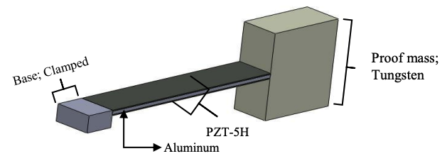

# Introduction to Finite Element Method of Partial Differential Equations and an Example of Its Application in Analyzing Energy Harversting from a Vibrating Piezoelectric Cantilever Beam

## Table of Contents
- [Overview](#Overview)
- [Purpose of FEM](#Purpose-of-FEM)
- [Background](#Background)
- [Steps of the Finite Element Method](#Steps-of-the-Finite-Element-Method)
- [Application of FEM in Analyzing Energy Harversting from a Vibrating Piezoelectric Cantilever Beam](#Application-of-FEM-in-Analyzing-Energy-Harversting-from-a-Vibrating-Piezoelectric-Cantilever-Beam)
- [References](#References)

## Overview
The finite element method (FEM) is a numerical technique used to approximate the solution of a boundary value partidal differential equation (PDE) by solving an algebraic system of equations. FEM discretizes the domain of the partial differential equation into a mesh of smaller and simpler subdomains, called elements, connected by nodes[https://www.simscale.com/blog/what-is-finite-element-method/]. Considering boundary conditions at the nodes, a system of basis functions are calculated to model these elements. These functions are then assembled into a larger system of equations over the entire domain and solved using numerical methods

## Purpose of FEM
The purpose of FEM is to create a simulation, also known as a finite element analysis (FEA). This simulation is used to provide a structural analysis of how a particular product or design would react under physical phenomenons in the real world. FEA breaks down the entire model into smaller elements within a mesh, which engineers use to test how the different elements of a design interact and perform under physical effects (e.g. vibration, heat, fluid flow, electromagnetic forces, and others) [https://www.autodesk.com/solutions/simulation/finite-element-analysis]. Such simulations are done with software packages that implement FEM to solve the PDEs governing these physical effects. Some common FEA software packages include ANSYS [https://www.ansys.com/], SIMSCALE [https://www.simscale.com/], Abaqus FEA [https://www.3ds.com/products-services/simulia/], and COMSOL Multiphysics [https://www.comsol.com/]. Shown below is an example of FEA analysis of a cantilever beam under pressure loading solid, shell, and beam elements in Abaqus FEA software. 

## Background: 
In discussing FEM it is important to first review the background of PDEs, boundary conditions, and numerial integration.

### Partial Differential Equations and Boundary Conditions
A PDE is an equation of partial derivatives of an unknown function with respect to more than one independent variable [txtbook chapter 11]. The order of a PDE is determined by the highest-order partial derivative appearing in the PDE. For example, consider the Euler-Bernoulli Beam PDE, a fourth-order PDE, representing the transverse displacement, **$u(x,t)$**, of a beam over space and time (with assumptions mentioned in [https://www.sciencedirect.com/science/article/abs/pii/B9780128185636000171]). : 

$$
EI \dfrac{\partial^4 u}{\partial x^4}= 0
$$

where **$E$** is the Young's modulus of the beam material and **$I$** is the moment of inertia of the beam's cross-sectional area. Now, to limit the possible solutions of the PDE, and any PDE in general, boundary conditions (BCs) must be provided. In doing so, the PDE becomes a boundary-value problem. Consider the BCs for the above Euler-Bernoulli Beam PDE for a clamped (fixed) piezoelectric cantilever beam with a proof mass at the free end [file:///Users/danielcanales/Desktop/Conference_4_ICME2019_BUETBangladesh.pdf]. In such a case, the proof mass is approximated as a shear force applied at the free end.

The BCs are: 

$$
\left.u\right|_{x=0}=0
$$

$$
\left.\dfrac{\partial u}{\partial x}\right|_{x=0}=0
$$

$$
\left.\dfrac{\partial^2 u}{\partial x^2}\right|_{x=L}=0
$$

$$
\left.EI\dfrac{\partial^3 u}{\partial x^3}\right|_{x=L} = m\dfrac{\partial^2 u}{\partial t^2}
$$

where **$L$** is the length of the beam, **$m$** is the mass of the proof mass, and **$\dfrac{\partial^2 u}{\partial t^2}$** is the acceleration of the proof mass. Note, with FEM, there are not only BCs for the domain of the problem, but also boundary conditions at the nodes of the problem's mesh. 

### Numerical integration
Numerical integration is an approximation of the definite integral of a function over a specific interval [notes Chapter 8]. As shown below, numerical integration assumes the the definitive integral, $I(f)$, over an interval, $[a,b]$, can be approximated as a quadrature rule, $Q_n(f)$, which is a weighted sum of $n$-number of sample values of the integrand function. 

$$
I(f) = \int_{a}^{b} f(x)dx
$$

$$
I(f) \approx Q_n(f) = \sum_{i=1}^n w_i f\left(x_i\right)
$$

where $x_i$ are called nodes and multipliers $w_i$ are called weights. There are several methods to determine the nodes and weights of the quadrature rule, such as equally spacing the nodes in the given interval (Newton-Cotes quadrature method) or using polynomials to interpolate between the given interval (Gaussian Quadtrature method). In the latter approach, the weights $w_i$ become polynomial functions $w_i(x)$, and they are chosen to maximize the degree of freedom of the resulting rule. In FEM, the Gaussian Quadrature method is used to to obtain the weighted functions, later referred to as the system of basis functions that models the elements of the problem's mesh.

## Steps of the Finite Element Method 
The FEM of a boundary-value problem can be generalized into the following steps [https://davis.wpi.edu/~matt/courses/fem/fem.htm, https://www.wias-berlin.de/people/john/LEHRE/NUM_PDE_FUB/num_pde_fub_4.pdf, https://www.iue.tuwien.ac.at/phd/orio/node48.html]:
- Step 1: Discretization of the problem's domain
- Step 2: Coordinate transofrmation of interpolation functions
- Step 3: Assembly of interpolation functions into a larger system of equations over the entire domain 
- Step 4: Solution of the system of equations

There are two main approaches for achieving the above steps: the Ritz method and Galerkin method [https://www.wias-berlin.de/people/john/LEHRE/NUM_PDE_FUB/num_pde_fub_4.pdf]. The above steps will be explained with a 1D problem using Galerkin's method from [https://www.iue.tuwien.ac.at/phd/orio/node45.html]. Consider the below problem:

$$
\begin{equation}
\tag{1}
  L[u(\vec{r})]=f(\vec{r})
\end{equation}
$$

defined in the problem domain **$\Omega$**, where **$L[\cdot]$** represents a linear differential operator, **$u(\vec{r})$** is the unknown function to be determined, and **$f(\vec{r})$** is a given source function.

### Discretization of the problem's domain
The discretization process will turn the problem into a linear system of equations over the entire problem domain. The process begins with transforming the PDE into an integral form, known as its weak form. [https://www.simscale.com/blog/what-is-finite-element-method/]. In this specific example, the weak form of the problem will not be explicitly derived, but left as a variational formulation. Multiplying a test function **$v(\vec{r})$** to (1) and integrating over the problem domain gives the variational fomrulation [https://vtechworks.lib.vt.edu/server/api/core/bitstreams/a792e408-2fb1-44ef-b862-ad32fb66ec45/content]:

$$
\begin{equation}
\tag{2}
  \int_{\Omega} v(\vec{r}) L[u(\vec{r})] d \Omega=\int_{\Omega} v(\vec{r}) f(\vec{r}) d \Omega
\end{equation}
$$

Using the notation $(a, b)=\int_{\Omega} a(\vec{r}) b(\vec{r}) d \Omega$, (2) can be written as

$$
\begin{equation}
\tag{3}
  (L[u], v)=(f, v)
\end{equation}
$$

Now that the problem is represented in an integral form, $\Omega$, can be divided into a set of $m$ elements, $T_{1}, T_{2}, \ldots, T_{m}$, which do not overlap. The mesh obtained by such a domain discretization is represented by

$$
\begin{equation}
\tag{4}
  T_{h}(\Omega)=\bigcup_{i=1}^{m} T_{i}
\end{equation}
$$

with a set of $N$ grid points. These grid points are the nodes of the problem's mesh. By using numerical integration, the approximate solution, $u_{h}(\vec{r})$, for $u(\vec{r})$ in (3) is given by the following weighted function [C. Johnson, Numerical Solution of Partial Differential Equations by The Finite Element Method.Cambridge University Press, 1987.]:

$$
\begin{equation}
\tag{5}
  u_{h}(\vec{r})=\sum_{i=1}^{N} u_{i} N_{i}(\vec{r})
\end{equation}
$$

where $N_{i}(\vec{r})$ are the basis functions. They are often referred to as the shape functions or interpolation functions of the FEM, and will be the focus of Step 2. The approximate solution of (3) is determined by the coefficients $u_{i}$. At node $i$, where the point is given by the coordinates $\vec{r}_{i}$, the basis functions must satisfy the below condition

$$
\begin{equation}
\tag{6}
  N_{i} \left(\vec{r}_{i}\right) = \delta _{ij}, \quad i, j=1, \ldots, N
\end{equation}
$$

For reasons that will be discussed in Step 2, the basis functions are typically chosen to be low order polynomials.

By substituting (5) in (4), and choosing $v=N_{j}(\vec{r})$, one obtains

$$
\begin{equation}
\tag{7}
  \left(L\left[\sum_{i=1}^{N} u_{i} N_{i}\right], N_{j}\right)=\left(f, N_{j}\right), \quad j=1, \ldots, N
\end{equation} 
$$

and since $L[\cdot]$ is a linear operator and the coefficients $u_{i}$ are constants, one can use the product rule in $L[\cdot]$ and then use numerical integration to write

$$
\begin{equation}
\tag{8}
  \sum_{i=1}^{N} u_{i}\left(L\left[N_{i}\right], N_{j}\right)=\left(f, N_{j}\right), \quad j=1, \ldots, N
\end{equation}
$$

Notice that Equation (8) is a linear system of $N$ equations with $N$ unknowns, $u_{1}, u_{2}, \ldots, u_{N}$. Therefore, (7) can be written in matrix notation as

$$
\begin{equation}
\tag{8}
  \mathbf{A x}=\mathbf{b}
\end{equation}
$$

where $\mathbf{A}=\left(a_{i j}\right)$ is called stiffness matrix, given by the elements

$$
\begin{equation}
\tag{9}
  a_{i j}=\left(L\left[N_{i}\right], N_{j}\right)=\int_{\Omega} L\left[N_{i}(\vec{r})\right] N_{j}(\vec{r}) d \Omega, \quad i, j=1, \ldots, N,
\end{equation}
$$

$\mathbf{x}=\left(u_{1}, \ldots, u_{N}\right)^{T}$ is the vector of unknown coefficients, and $\mathbf{b}=\left(b_{1}, \ldots, b_{N}\right)^{T}$ is the load vector, given by

$$
\begin{equation}
\tag{10}
  b_{j}=\left(f, N_{j}\right)=\int_{\Omega} f(\vec{r}) N_{j}(\vec{r}) d \Omega, \quad j=1, \ldots, N
\end{equation}
$$

As a result, by implementing the Galerkin Method, the problem in (1) has been discretized into a system of elements connected at nodes and can be expressed as (8); a system of equations over the entire problem domain. 

### Coordinate transformation of interpolation functions
The interpolation function $N_i$ is the function which interpolates the solution between the discrete values $u_i$ obtained at the mesh nodes. Therefore, the interpolation functions dictacte the formulation of elements. As mentioned earlier, low order polynomials, known as shape functions, are typically chosen for the interpolation functions. Shown below are common elements of linear functions in 2D and 3D [https://www.comsol.com/multiphysics/finite-element-method?parent=physics-pdes-numerical-042-62#triangularno]. 

To obtain the discrete system of equations in (7), the shape functions have to be derived and integrated (shown in (9) and (10)). Such calculations can be significantly simplified by completing a coordinate transformation [https://www.iue.tuwien.ac.at/phd/orio/node48.html, http://mofem.eng.gla.ac.uk/mofem/html/integration.html], as shown below, from the problem's domain coordinate system $(x, y, z)$ to the element's reference (local) coordinate system $(\xi, \eta, \zeta)$. The coordinate transformation can be achieved with the Jacobian transformation method. An example of this process is discussed below and comes from [https://www.iue.tuwien.ac.at/phd/orio/node48.html].

As shown in the above image, consider a tetrahedron finite element in a cartesian system shown. Referring back to (6) in the previous step, the element's linear shape function of node $i$ (where $i = 1,..,4$) has the form [153]

$$
\tag{11}
N_{i}(x, y, z)=a_{i}+b_{i} x+c_{i} y+d_{i} z,
$$

in the problem's domain system. Therefore, in addition to calculating the derivatives and integrals (shown in (9) and (10) of the nodal basis functions for the tetrahedron elements, the above coefficients for each element would have to be calculated as a system of equations, while considering the condition in (6). Thus the process of forming the element becomes quite complex. Now, by using the Jacobian transformation method and expressing the element's reference coordinate system as:

$$
\tag{12}
\begin{aligned}
& N_{1}^{t}(\xi, \eta, \zeta)=1-\xi-\eta-\zeta, \\
& N_{2}^{t}(\xi, \eta, \zeta)=\xi \\
& N_{3}^{t}(\xi, \eta, \zeta)=\eta \\
& N_{4}^{t}(\xi, \eta, \zeta)=\zeta
\end{aligned}
$$

the shape functions for the tetrahedron elements are now rather simple. Therefore, once the coordinate system has been transformed, the derivatives and integrals of the shape functions can be evaluated more easily in the transformed coordinate system. In general terms, given a function $f(x, y, z)$, the gradient in the transformed coordinates can be expressed as

$$
\tag{13}
\nabla^{t} f=\left[\begin{array}{lll}
\frac{\partial f}{\partial \xi} & \frac{\partial f}{\partial \eta} & \frac{\partial f}{\partial \zeta}
\end{array}\right]^{T}
$$

where the derivatives are calculated via the chain rule by

$$
\tag{14}
\begin{aligned}
& \frac{\partial f}{\partial \xi}=\frac{\partial f}{\partial x} \frac{\partial x}{\partial \xi}+\frac{\partial f}{\partial y} \frac{\partial y}{\partial \xi}+\frac{\partial f}{\partial z} \frac{\partial z}{\partial \xi} \\
& \frac{\partial f}{\partial \eta}=\frac{\partial f}{\partial x} \frac{\partial x}{\partial \eta}+\frac{\partial f}{\partial y} \frac{\partial y}{\partial \eta}+\frac{\partial f}{\partial z} \frac{\partial z}{\partial \eta} \\
& \frac{\partial f}{\partial \zeta}=\frac{\partial f}{\partial x} \frac{\partial x}{\partial \zeta}+\frac{\partial f}{\partial y} \frac{\partial y}{\partial \zeta}+\frac{\partial f}{\partial z} \frac{\partial z}{\partial \zeta}
\end{aligned}
$$

These equations can be expressed in matrix notation as

$$
\tag{15}
\left[\begin{array}{l}
\frac{\partial f}{\partial \xi} \\
\frac{\partial f}{\partial \eta} \\
\frac{\partial f}{\partial \zeta}
\end{array}\right]=\left[\begin{array}{lll}
\frac{\partial x}{\partial \xi} & \frac{\partial y}{\partial \xi} & \frac{\partial z}{\partial \xi} \\
\frac{\partial x}{\partial \eta} & \frac{\partial y}{\partial \eta} & \frac{\partial z}{\partial \eta} \\
\frac{\partial x}{\partial \zeta} & \frac{\partial y}{\partial \zeta} & \frac{\partial z}{\partial \zeta}
\end{array}\right] \cdot\left[\begin{array}{l}
\frac{\partial f}{\partial x} \\
\frac{\partial f}{\partial y} \\
\frac{\partial f}{\partial z}
\end{array}\right]
$$

or

$$
\tag{16}
\nabla^{t} f=\mathbf{J}^{T} \nabla f
$$

where $\mathbf{J}^{T}$ is the transpose of the Jacobian matrix. Therefore, the gradient in the original coordinate system can be calculated using the transformed coordinate gradient by

$$
\tag{17}
\nabla f=\left(\mathbf{J}^{T}\right)^{-1} \nabla^{t} f=\boldsymbol{\Lambda} \nabla^{t} f
$$

where $\boldsymbol{\Lambda}=\left(\mathbf{J}^{T}\right)^{-1}$.

As a result, performing a coordinate transformation significantly simplifies steps (9) and (10) of Galerkin's FEM. The nodal interpation (shape) functions in the transformed coordinates are fixed and known in advance. Therefore, it is not necessary to solve the system of equations formed by (11) for each element of the mesh. Instead, only the Jacobian matrix has to be determined. 

### Assembly of interpolation functions into a larger system of equations over the entire domain 
In order to solve the syste of equation in (8), the global stiffness matrix, $\mathbf{A}$, and the load vector, $\mathbf{b}$, have to be determined. This solution can be ahieved by completing a process known as assembly, in which $\mathbf{A}$ and $\mathbf{b}$ can be computed by 1) computing their nucleus matrices for each element and then 2) summing their contributions from each element according to (8). The derivation of assembly is discussed below and comes from [https://www.iue.tuwien.ac.at/phd/orio/node47.html].

Instead of computing (8) using (9) and (10), they are computed, in practice, by summing the contributions from the different elements [C. Johnson, Numerical Solution of Partial Differential Equations by The Finite Element Method.Cambridge University Press, 1987.
R. E. White, An Introduction to The Finite Element Method with Applications to Nonlinear Problems.John Wiley and Sons, Inc., 1985.
P. Knabner and L. Angermann, Numerik partieller Differential-gleichungen. Springer, 2000.] according to

$$
\tag{18}
a_{i j}=\sum_{T \in T_{h}(\Omega)}\left(L\left[N_{i}\right] , N_{j} \right) _ {T}=\sum_{T \in T_{h}(\Omega)} \int_{T} L\left[N_{i}(\vec{r})\right] N_{j}(\vec{r}) d \Omega, \quad i, j=1, \ldots, N
$$

$$
\tag{19}
b_{j}=\sum_{T \in T_{h}(\Omega)}\left(f, N_{j}\right) _ {T}=\sum_{T \in T_{h}(\Omega)} \int_{T} f(\vec{r}) N_{j}(\vec{r}) d \Omega, \quad j=1, \ldots, N .
$$

Since $(L\left[N_{i}\right], N_{j}) _ {T} =0$ unless both $N_{i}$ and $N_{j}$ belong to the same element $T$, the calculations of (18) and (19) can be limited to the nodes of the element $T$, so that $i, j=1, \ldots, N_{V}$, where $N_{V}$ is the number of vertices of the element. Therefore, for each element $T \in T_{h}(\Omega)$, a $N_{V} \times N_{V}$ matrix is obtained, which is called element stiffness or nucleus matrix. Thus, the general system matrix, A, can be computed by first computing the nucleus matrices for each $T \in T_{h}(\Omega)$ and then summing the contributions from each element according to (18). The right-hand side vector, $\mathbf{b}$, is computed similarly. 

Therefore, the main advantage of this assembly process is that it greatly simplifies the computation of the system matrix and right-hand side vector, since (9) and (10) can be easily calculated for each element of the domain discretization.

### Solution of the system of equations
Once the matrix equations of global stiffness matrix $\mathbf{A}$ and the load vector $\mathbf{b}$ have been established, the equations are passed onto a FEM solver. Generally speaking, these solvers are numerical methods divided into two types: direct and iterative solvers [https://www.simscale.com/blog/how-to-choose-solvers-for-fem/]. 

Direct solvers perform a unique sequence of operations on the coefficients of the system. In addition to the degrees of freedom of the problem, the size, sparsity, structure, and distribution of the matrix have an impact on the direct solvers' solution. Common direct solvers include Gaussian elimination, lower–upper (LU) decomposition, Colesky, and QR decomposition. 

On the other hand, iterative solvers begin with an inital guess for the solution and refine it through a series of iterations, converging towards the solution. In addition, iterative solvers use a procedure called “preconditioning”. In simple terms, the condition number of a matrix can be expressed as the ratio of the absolute value of biggest to smallest number in the matrix. As the condition number increases, the equation system becomes less stable, thus highly likely to magnify approximation errors. In addition to the condition number, the convergence of the iterative method has an impact on the iterative solvers' solutions [https://academic.oup.com/ptp/article/10/6/653/1831185]. While beyond the scope of this article, there are many properties of the problem and its system of equations that determine the condition number and convergence of the iterative solver. Common iterative solvers include Conjugate Gradient Method and its variants, Generalized Minimial Residual Methods, and Chebyshev iteration.

## Application of FEM in Analyzing Energy Harversting from a Vibrating Piezoelectric Cantilever Beam
An example of applying FEM in the field of electrical engineering is harvesting energy from  piezoelectric structures, a common practice used to power lower-power electronic devices [Liu H,  Tay CJ,  Quan C,  Kobayashi T,  Lee C. Piezoelectric MEMS  energy harvester  for low-frequency vibrations  with  wideband  operation  range  and  steadily  increased  output  power.    Journal  of Microelectromechanical Systems, 2011 Sep 1;20(5):1131-42. ]. In general, when a piezoelectric cantilever beam is physically deformed by pressure, vibration or force, then it will generate electrical charge density, calculated by the piezoelectric constitutive equation in [Gong LJ, Shen X, Li  JQ. Experimental  investigation of energy harvesting from triple-layer piezoelectric bender. In 18th IEEE International Symposium on the Applications of Ferroelectrics 2009 Aug 23 (pp. 1-6). IEEE.]. Maximum energy is harvested when it vibrates at its resonant frequency. 

A FEM simulation presented in [[https://www.researchgate.net/publication/349626774_Finite_element_analysis_of_piezoelectric_cantilever_beam_using_vibration_for_energy_harvesting_devices?enrichId=rgreq-f5ea3cac4d29a2073657f996d6177b34-XXX&enrichSource=Y292ZXJQYWdlOzM0OTYyNjc3NDtBUzoxMDM1NjAwMzM3NTgwMDMzQDE2MjM5MTc3Njk3MTA%3D&el=1_x_3&_esc=publicationCoverPdf)]] demonstrates the energy harvested from a vibrating piezoelectric cantilever beam with a proof mass on its free end. The beam, shown in Figure 1, was designed in SolidWorks using the dimensions shown below in Table 1, and the FEM simulation was performed in COMSOL Multiphysics. The material properties used in the FEM simulation are shown below in Table 2. The boundary conditions of the simulation were set such that the beam is clamped on one end and the rest of the it was free to vibrate with a mechanical damping set to 0.001 for both layers. The beam was kept at an acceleration vibration sources of $1g$ ($g = 9.8m/s^2$). A physics-controlled mesh with fine element size was performed for the beam, resulting in a voltage output of 4.4 mV at a resonant frequency of 192.25 Hz, as shown in Figure 2 and 3.

## References

1. Choi, S.-K., Grandhi, R. V., &amp; Canfield, R. A. (2007). Chapter 5: Reliability-based Structural Optimization. In Reliability-based Structural Design (pp. 153–202), Springer-Verlag London.
2. Malisani, P., Chaplais, F., &amp; Petit, N. (2014). An interior penalty method for optimal control problems with state and input constraints of Nonlinear Systems. Optimal Control Applications and Methods, 37(1), 3–33. https://doi.org/10.1002/oca.2134 
3. Heath, M. T. (2009). Chapter 6: Optimization. In Scientific computing: An introductory survey (pp. 256–308), McGraw Hill.
4. Knight, J. (2018). Al-Kash. In Encyclopedia.com. Infonautics Corp.
5. Saad, Y. (2020). Iterative methods for linear systems of equations: A brief historical journey. 75 Years of Mathematics of Computation, 197–215. https://doi.org/10.1090/conm/754/15141 
6. Ebenau, C., Rottschäfer, J., &amp; Thierauf, G. (2005). An advanced evolutionary strategy with an adaptive penalty function for mixed-discrete structural optimisation. Advances in Engineering Software, 36(1), 29–38. https://doi.org/10.1016/j.advengsoft.2003.10.008 
7. Yeniay, Ö. (2005). Penalty function methods for constrained optimization with genetic algorithms. Mathematical and Computational Applications, 10(1), 45–56. https://doi.org/10.3390/mca10010045 
8. Grasmeyer, J., &amp; Grasmeyer, J. (1997). Application of a genetic algorithm with adaptive penalty functions to airfoil design. 35th Aerospace Sciences Meeting and Exhibit. https://doi.org/10.2514/6.1997-7
9. Reddy, J. N. (1982). On penalty function methods in the finite-element analysis of flow problems. International Journal for Numerical Methods in Fluids, 2(2), 151–171. https://doi.org/10.1002/fld.1650020204 
10. Kim, S. J., &amp; Kim, J. H. (1993). Finite element analysis of laminated composites with contact constraint by extended interior penalty methods. International Journal for Numerical Methods in Engineering, 36(20), 3421–3439. https://doi.org/10.1002/nme.1620362003 
11. Bäeck Thomas, Fogel, D., Michalewicz, Z., Coit, D. W., &amp; Smith, A. E. (1995). Section C 5.2: Penalty Functions. In Handbook of Evolutionary Computation, Oxford University Press and Institute of Physics Publishing.
12. Michalewicz, Z. (1995). Genetic Algorithms, Numerical Optimization, and Constraints. Retrieved December 7, 2022, from https://cs.adelaide.edu.au/~zbyszek/Papers/p16.pdf.
13. Nocedal, J., &amp; Wright, S. J. (2006). Chapter 17: Penalty and Augmented Lagrangian Methods. In Numerical optimization (pp. 497–528), Springer.
14. Luenberger, D., &amp; Ye, Y. (2008). Chapter 13: Penalty and Barrier Methods. In Linear and nonlinear programming (4th ed., Ser. Operations Research and Management Science, pp. 409–440), Springer.

-->
